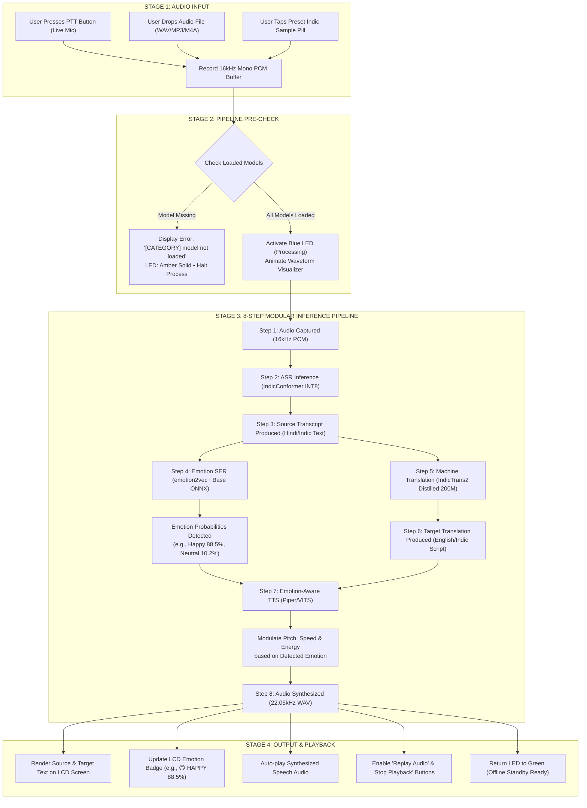
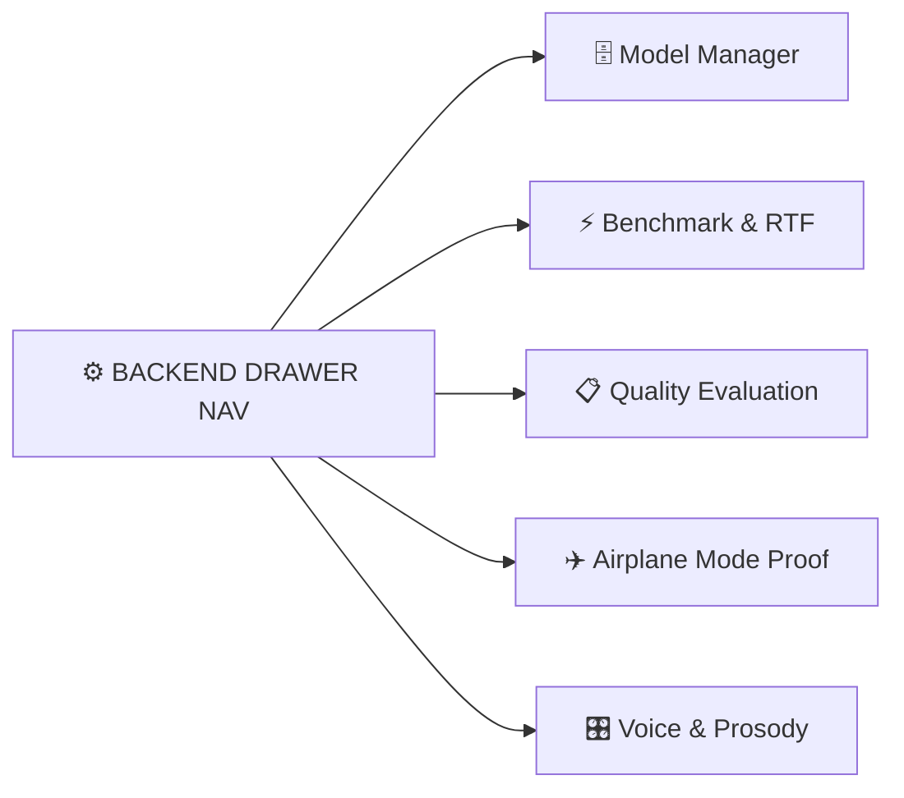
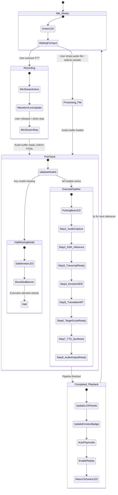

# AI Portable Language Translator: UI Mind Map & Workflow Blueprint

> **A Complete UI/UX Specification & Workflow Guide for UI Designers and Developers**  
> *Application:* 100% Offline Speech-to-Speech Indic AI Translator (ASR + SER + IndicTrans2 + Expressive TTS)  
> *Platforms:* Handheld Hardware Simulator & Production Android Mobile App (Jetpack Compose / Flutter)

---

## 1. Master UI Mind Map

```mermaid
mindmap
  root((🎙️ AI Portable Translator))
    1. Primary Translator Screen
      Header & Status Bar
        Offline Mode Pill (100% On-Device)
        System RAM Meter (psutil MB)
        Hardware LEDs (Offline / Processing / Standby)
        Backend Drawer Toggle Button
      Language Configuration
        Source Language Dropdown (22 Indic + English)
        Swap Language Button (⇄)
        Target Language Dropdown
      Audio Visualizer & LCD Display
        Live Audio Waveform Canvas
        Audio Duration Tag
        Source Transcript Panel + ASR Model Badge
        Target Translation Panel + Emotion Badge
        Pipeline Error Banner (Strict Unloaded Halts)
      Physical & Handheld Controls
        Main Push-to-Talk (PTT) Button (Glow / Pulse)
        Run Translate Action Button
        Replay Audio Button
        Stop Playback Button
        Hardware Speaker Grille
      Audio Input Switcher
        Live Microphone Input Mode
        Local Audio File Drag-and-Drop Zone
        Preset Indic Audio & Emotion Pills
      8-Stage Real-Time Pipeline Stepper
        Step 1: Audio Captured (16kHz PCM)
        Step 2: IndicConformer ASR Running
        Step 3: Source Transcript Produced
        Step 4: emotion2vec+ Emotion SER Analysis
        Step 5: IndicTrans2 Translation Running
        Step 6: Target Translation Produced
        Step 7: Emotion-Aware TTS Running
        Step 8: Audio Synthesized (Speaker WAV Out)
    2. Backend & Advanced AI Drawer
      Tab 1: Model Manager
        Category Sections (ASR, Emotion SER, MT, TTS)
        Model Inventory Cards (Size, RAM, Latency, Format)
        Actions: Load / Unload / Test / Delete
        + Import Local Model CTA
      Tab 2: Benchmark & Realtime Factor (RTF)
        Realtime Factor Score Card (RTF < 0.70 Green)
        Total Pipeline Latency Meter
        RAM Consumption Tracker
        Stage Latency Breakdown (ASR, SER, MT, TTS)
        Head-to-Head Model Comparison Table
        Historical Benchmark Runs Table
      Tab 3: Quality Evaluation Suite
        10 Real-World Indic Domains
        Prototype Accuracy Score (%)
        Correct / Mostly Correct / Needs Improvement Tags
        Domain Translation Diff Table
      Tab 4: Airplane Mode & Isolation Proof
        Strict Airplane Mode Toggle
        Zero-Network Audit Runner
        5-Point Local Execution Verification Checklist
        Diagnostic Terminal Log
      Tab 5: Voice Prosody & Emotion SER
        9-Emotion Probability Meters (Softmax Distribution)
        Emotional Sample Test Matrix
        Speaking Rate Slider (0.6x - 1.8x)
        Pitch Scale Slider (0.7x - 1.5x)
        Energy / Volume Slider (0.5x - 1.5x)
        Expressiveness Slider (0.0 - 1.0)
        Target Emotion Preset Selector
    3. Modals & Overlays
      Import Model Modal Dialog
        Category Selector (ASR, MT, TTS, SER)
        Local Weights File Upload (.onnx, .bin, .pt)
        Model Name & Version Fields
        Runtime Format (ONNX-INT8, CTranslate2)
        Supported Languages Input
      Missing Model Error Banner / Modal
        Category Unloaded Warning
        Direct CTA to Model Manager
```

---

## 2. End-to-End User Workflow & Data Pipeline



---

## 3. Screen-by-Screen Layout & UI Specifications

### Screen 1: Main Handheld Translator (Home Screen)
*The primary interactive screen simulating a dedicated handheld device or smartphone translation interface.*

```
+-------------------------------------------------------------------------------+
|  🎙️ AI Portable Language Translator           [● OFFLINE LOCAL]  RAM: 210 MB  [⚙️ BACKEND] |
+-------------------------------------------------------------------------------+
|  ⚡ Pipeline: Audio → IndicConformer → emotion2vec+ → IndicTrans2 → IndicTTS → Speech |
+-------------------------------------------------------+-----------------------+
|  +-------------------------------------------------+  |  AUDIO INPUT SOURCE   |
|  | INDIC-TRANSLATOR // MK-1      (🟢 LED) (🔵) (🟡)|  | [🎙️ Live Mic] [📁 File]|
|  | +---------------------------------------------+ |  |                       |
|  | | ● OFFLINE LOCAL   [😊 HAPPY 88.5%]  12:45:00 | |  | Drag & drop audio or  |
|  | +---------------------------------------------+ |  | tap sample pills:     |
|  | | [Source Lang: Hindi ▾] ⇄ [Target: English ▾]| |  | (Neutral)(Happy)(Angry)
|  | +---------------------------------------------+ |  |                       |
|  | | ~~~~~ LIVE AUDIO WAVEFORM VISUALIZER ~~~~~~ | |  | PIPELINE STEPPER      |
|  | | [ Audio Ready: 3.2s ]                       | |  | [✓] 1. Audio Captured |
|  | +---------------------------------------------+ |  | [✓] 2. ASR Running     |
|  | | SOURCE TRANSCRIPT (IndicConformer INT8):     | |  | [✓] 3. Transcript Out |
|  | | "नमस्ते, मुझे रेलवे स्टेशन का रास्ता बताइए।"| |  | [✓] 4. Emotion SER    |
|  | +---------------------------------------------+ |  | [✓] 5. Translation MT  |
|  | | TRANSLATION (IndicTrans2 Distilled INT8):   | |  | [✓] 6. Target Text Out |
|  | | "Hello, please tell me the way to station." | |  | [✓] 7. TTS Synthesizer |
|  | +---------------------------------------------+ |  | [✓] 8. Speaker Audio   |
|  +-------------------------------------------------+  +-----------------------+
|  | [        🎙️ PUSH TO TALK (HOLD / TAP)         ] |                          |
|  | [  ⚡ RUN TRANSLATE  ]   [  🔊 REPLAY AUDIO   ] |                          |
|  | [               ⏹ STOP PLAYBACK               ] |                          |
|  |                 :: SPEAKER GRILLE ::            |                          |
|  +-------------------------------------------------+                          |
+-------------------------------------------------------------------------------+
```

#### UI Elements & Specifications:
1. **Chassis & Bezel**: Dark industrial slate chassis with metallic chamfered borders.
2. **Tri-Color Hardware LEDs**:
   - 🟢 **Green**: Offline Active & Ready for speech.
   - 🔵 **Blue (Pulsing)**: Neural Network Inference Active.
   - 🟡 **Amber**: Standby / Model Not Loaded warning.
3. **Dual LCD Display**: High-contrast OLED green/cyan styling showing source and target transcripts.
4. **Push-to-Talk (PTT) Button**: High-visibility glowing CTA button with active pressing animations and ripple effects.
5. **Language Switcher**: Quick swap button (`⇄`) with intuitive dropdowns supporting 22 scheduled Indian languages + English.

---

### Screen 2: Backend AI Drawer & Advanced Tools
*Accessed via the top-right `⚙️ BACKEND` button. Slides in as an overlay drawer or tabbed management dashboard.*



#### Tab 2.1: Model Manager
- **Purpose**: Manage on-device AI model weights without touching file system directories manually.
- **Components**:
  - **Category Panels**: Automatic Speech Recognition (ASR), Speech Emotion Recognition (SER), Machine Translation (MT), Text-to-Speech (TTS).
  - **Model Cards**: Name, Version, Format (`ONNX-INT8`, `CTranslate2`), Size (MB), RAM Consumption, Inference Latency.
  - **Action Buttons**: `LOAD`, `UNLOAD`, `TEST`, `DELETE`.
  - **Primary CTA**: `+ IMPORT LOCAL MODEL` (opens upload modal).

#### Tab 2.2: Benchmark & Realtime Factor (RTF)
- **Purpose**: Hardware performance profiling to guarantee real-time latency on mobile hardware.
- **Formula Highlighted**:
  $$\text{Realtime Factor (RTF)} = \frac{\text{Processing Time (s)}}{\text{Audio Duration (s)}}$$
- **Components**:
  - **RTF Badge**: Color-coded rating:
    - 🟢 **Green (RTF < 0.70)**: Realtime execution.
    - 🟡 **Yellow (0.70 ≤ RTF ≤ 1.20)**: Near-realtime execution.
    - 🔴 **Red (RTF > 1.20)**: High latency / throttled.
  - **Latency Breakdown Bar**: Visual stacked bar showing milliseconds spent in ASR, SER, MT, and TTS.
  - **Head-to-Head Comparison Table**: Runs identical audio through alternative models (e.g., IndicConformer vs Whisper Tiny; IndicTrans2 vs IndicTrans2 Indic-Indic).

#### Tab 2.3: Translation Quality Evaluation (10 Indic Domains)
- **Purpose**: Field accuracy testing across 10 critical conversational domains:
  1. *Pharmacy & Medical*
  2. *Emergency & Urgent*
  3. *Railway & Transit*
  4. *Hospital & Healthcare*
  5. *Dialects & Accents*
  6. *Hinglish / Code-Switching*
  7. *Navigation & Directions*
  8. *Police & Security*
  9. *Market & Shopping*
  10. *Greetings & Formalities*
- **Components**:
  - **Prototype Accuracy Gauge**: Large percentage score.
  - **Evaluation Action Tags**: Interactive feedback tags (`Correct`, `Mostly Correct`, `Needs Improvement`).
  - **Diff Highlighting**: Expected translation vs Actual model output.

#### Tab 2.4: Airplane Mode & Zero-Network Audit
- **Purpose**: Physical proof that the application runs 100% locally with zero cloud dependencies or web tracking.
- **Components**:
  - **Enforcement Switch**: Strict Airplane Mode Toggle.
  - **5-Point Security Audit Checklist**:
    - ✓ Browser SpeechRecognition disabled (0 WebSpeech leaks)
    - ✓ emotion2vec+ (9.25 MB) loaded 100% locally from disk
    - ✓ Google Translate / Cloud MT APIs blocked
    - ✓ Cloud TTS disabled (local Piper synthesizer only)
    - ✓ All model weights loaded strictly from local storage
  - **Diagnostic Terminal Console**: Live audit log showing blocked network sockets.

#### Tab 2.5: Voice Prosody & Emotion SER Analyzer
- **Purpose**: Inspect real acoustic emotion distributions and customize expressive speech synthesis parameters.
- **Components**:
  - **Emotion Probability Distribution Bars**: Real-time softmax confidence meters for 9 emotional states (Neutral, Happy, Angry, Sad, Fearful, Surprised, Disgusted, Contemptuous, Other).
  - **Prosody Sliders**:
    - *Speaking Rate* ($0.6\times - 1.8\times$)
    - *Pitch Scale* ($0.7\times - 1.5\times$)
    - *Volume Energy* ($0.5\times - 1.5\times$)
    - *Expressiveness Index* ($0.0 - 1.0$)
  - **Target Emotion Presets**: Quick dropdown to test voice expressions.

---

## 4. UI State Machine & Interaction Logic



---

## 5. Design System & Style Tokens (For UI Maker / Figma)

### Color Palette

| Token Name | Hex Code | Purpose | Preview |
| :--- | :--- | :--- | :--- |
| `--bg-base` | `#070b14` | Main application dark background |  |
| `--bg-surface` | `#0d1527` | Chassis & Card container background |  |
| `--bg-lcd` | `#040810` | Handheld LCD screen background |  |
| `--accent-cyan` | `#00e5ff` | Primary active accent & data flow |  |
| `--accent-blue` | `#2979ff` | ASR stage & buttons |  |
| `--accent-purple` | `#7c4dff` | Translation stage & badges |  |
| `--color-green` | `#00e676` | Ready LED, Online status, Realtime RTF |  |
| `--color-amber` | `#ff9100` | Emotion SER badge, Warning LED |  |
| `--color-red` | `#ff1744` | High latency RTF, Missing model error |  |
| `--text-primary` | `#f0f6fc` | High-emphasis headings and transcripts |  |
| `--text-muted` | `#64748b` | Sub-labels and inactive badges |  |

---

### Typography Hierarchy

- **Brand / Titles**: `Space Grotesk`, `Outfit`, or `Inter` (Font weight: 700 / 800)
- **LCD Display & Transcripts**: `Inter` or `Noto Sans Indic` (Supporting Devanagari, Tamil, Telugu, etc.)
- **System Telemetry & Metrics**: `JetBrains Mono` or `Roboto Mono` (For RAM, RTF, Latency, and Timestamps)

---

### Key UI Component Guidelines for Designer:
1. **Push-to-Talk (PTT) Button**:
   - Must be large, centered, and thumb-accessible on mobile screens.
   - States: Idle (Soft Cyan Border), Pressed/Recording (Pulsing Red/Cyan Ripple), Disabled/Processing (Subdued Slate).
2. **Audio Waveform Canvas**:
   - Visualizes live mic frequencies during recording and smooth animated sine waves during playback.
3. **Model & Emotion Pills**:
   - Rounded badges with glowing dot indicators showing the exact loaded model for each stage.
4. **Offline Badge**:
   - Always prominent in the top bar (`● OFFLINE LOCAL`) to instill confidence that data never leaves the device.

---

## 6. Summary Checklist for UI Maker

- [x] **Primary Translation Screen** with Push-to-Talk and dual transcript LCD.
- [x] **8-Stage Pipeline Stepper** visualizing audio through ASR, SER, MT, and TTS.
- [x] **Model Manager** for managing local quantized ONNX and CTranslate2 weights.
- [x] **Hardware Benchmark & RTF Screen** with color-coded latency metrics.
- [x] **10-Domain Translation Quality Suite** with prototype accuracy rating.
- [x] **Airplane Mode & Zero-Network Proof** with interactive audit checklist.
- [x] **Voice Prosody & Emotion SER Panel** with 9-class probability distribution.
- [x] **Import Model Modal** for registering new local neural networks.
